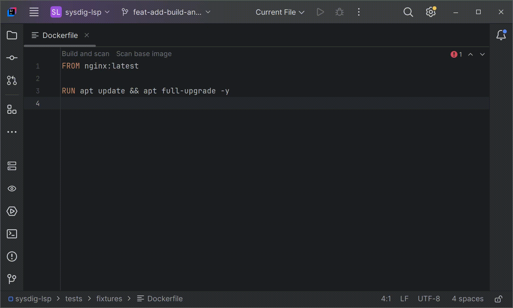

# Build and Scan

Sysdig LSP builds your entire Dockerfile and scans the resulting final image to identify vulnerabilities early in your development workflow.
This ensures the exact image used in production is secure and compliant.

> [!IMPORTANT]
> Sysdig LSP analyzes the fully built final image, including all instructions executed during the build process.
>
> In multi-stage Dockerfiles, only artifacts copied into the final stage using instructions like `COPY --from=build` are analyzed, as intermediate stages are not part of the final runtime environment.



## Examples

### Single-stage Dockerfile (scanned entirely)

```dockerfile
# Base image and all instructions are scanned
FROM alpine:latest
RUN apk add --no-cache python3
COPY ./app /app
```

### Multi-stage Dockerfile (partially scanned)

```dockerfile
# Build stage (scanned only for artifacts copied to final stage)
FROM golang:1.19 AS build
RUN go build -o app main.go

# Final image (fully scanned)
FROM alpine:3.17
COPY --from=build /app /app
ENTRYPOINT ["/app"]
```

In this multi-stage Dockerfile, Sysdig LSP scans the complete final built image, including the final runtime stage (`alpine:3.17`) and any artifacts explicitly copied from previous stages (`golang:1.19`).
