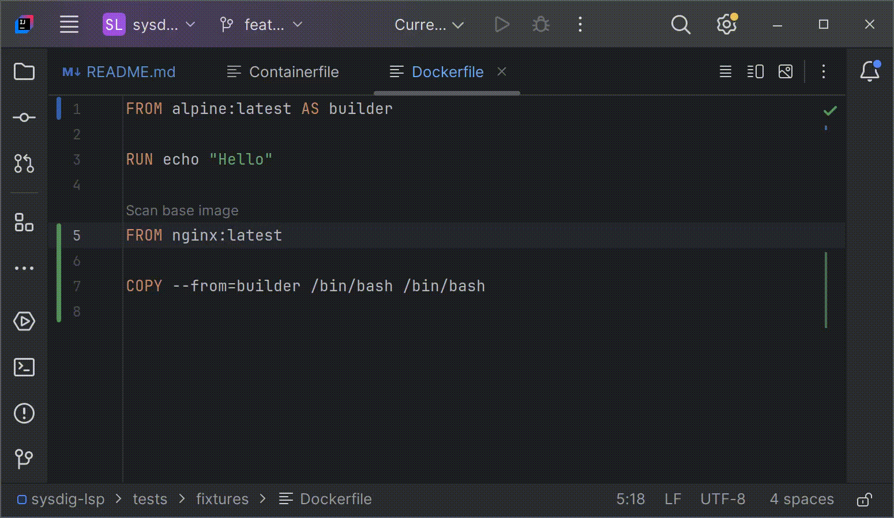

# Code Lens Support

A CodeLens is a feature that displays additional information about the code,
such as suggestions, references, or action buttons, directly in the editor without modifying the code itself.

For example, in VS Code, you might see something like "Used 3 times" above a function,
with an option to click and view references.

In our case, for the **Sysdig LSP**, **CodeLens** allows executing actions that can also be
performed with **Code Actions** (like [scanning the base image](./scan_base_image.md)), but in a more graphical way by simply clicking.
This enhances usability by providing direct interaction within the editor.

