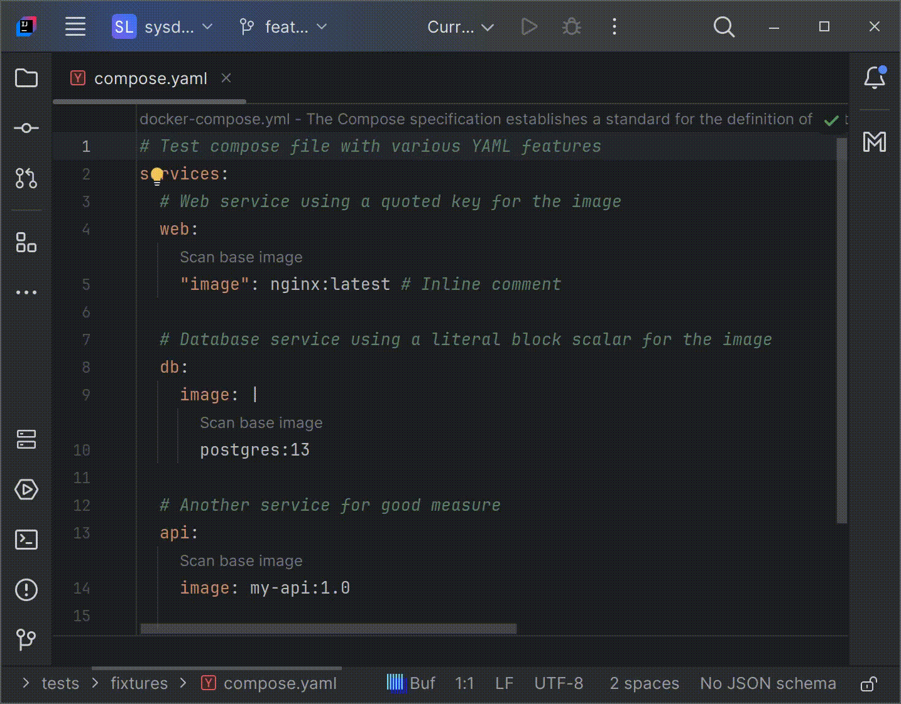

# Docker-compose Image Analysis

Sysdig LSP scans the images defined in your `docker-compose.yml` files to identify vulnerabilities.

> [!IMPORTANT]
> Sysdig LSP analyzes each service's image in your compose file.



## Example

```yaml
services:
  web:
    image: nginx:latest
  db:
    image: postgres:13
```

In this example, Sysdig LSP will provide actions to scan both `nginx:latest` and `postgres:13` images.
