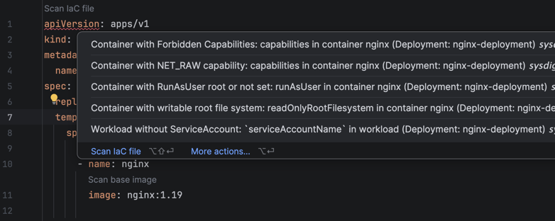

# Infrastructure-as-Code Analysis

Sysdig LSP scans your Infrastructure-as-Code files for misconfigurations and reports the findings as diagnostics in your editor's problems panel.

> [!IMPORTANT]
> Sysdig LSP analyzes IaC files from disk, not from the editor buffer.
>
> Save the file before scanning to analyze unsaved changes.



## Usage

The feature is exposed through a single command, `sysdig-lsp.execute-iac-scan`, which accepts an optional path:

- **Without arguments**: scans the workspace root recursively. All IaC files the scanner understands (Kubernetes
  manifests, Terraform, etc.) are analyzed. Requires the client to have sent a workspace root (via `workspaceFolders`
  or `rootUri`) during initialization.
- **With a file URI**: scans just that file. This is what the **"Scan IaC file"** code lens (shown at the top of
  Kubernetes manifests and Docker Compose files) invokes. The argument must be a valid `file://` URI; anything else is
  rejected.

## Example

```yaml
apiVersion: apps/v1
kind: Deployment
metadata:
  name: web-deployment
spec:
  replicas: 3
  template:
    spec:
      containers:
      - name: nginx
        image: nginx:1.19
```

In this example, Sysdig LSP will offer a **"Scan IaC file"** code lens at the top of the manifest. Running it reports
every misconfiguration found by the scanner (e.g. missing memory limits for the `nginx` container) as a diagnostic on
the file.

## Diagnostics

Each finding is reported as a diagnostic on the affected file with `source: "sysdig-iac"`:

- Message format: `<rule name>: <location> (<resource type>: <resource name>)`
- Severity mapping: `high` → Error, `medium` → Warning, `low`/unknown → Information

Diagnostics from different scan types coexist on the same document: image scan diagnostics are tagged with
`source: "sysdig-vuln"` and are never touched by IaC scans (and vice versa). Re-scanning refreshes only the IaC
diagnostics in scope: a single-file scan replaces that file's findings, a workspace scan replaces them for every file
under the scanned root.

## Limitations

- Findings are anchored at the top of the file (range `0,0`): the CLI scanner reports the location as an opaque string
  which is included in the diagnostic message instead.
- No code lens on Terraform files yet: most LSP clients are configured to route only `dockerfile` and `yaml` file types
  to Sysdig LSP. Terraform files are still covered by the recursive workspace scan.
- Editing a file does **not** clear its IaC diagnostics (they anchor at the top of the file and stay meaningful);
  re-run the scan to refresh them. Vulnerability diagnostics, which anchor to specific lines, are cleared on edits.
- Multi-root workspaces: only the first workspace folder is scanned by the workspace-wide command. Findings for files
  outside that folder (e.g. produced by single-file scans) are preserved.
