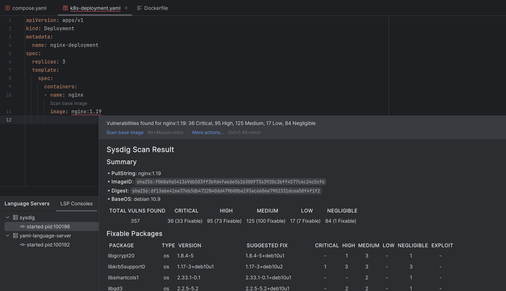

# Kubernetes Manifest Image Analysis

Sysdig LSP scans the container images defined in your Kubernetes manifest files to identify vulnerabilities.

> [!IMPORTANT]
> Sysdig LSP analyzes container images from `containers` and `initContainers` in your Kubernetes manifests.



## Supported Kubernetes Resources

Sysdig LSP supports scanning images from the following Kubernetes resource types:

- Pods
- Deployments
- StatefulSets
- DaemonSets
- Jobs
- CronJobs
- ReplicaSets

## Example

```yaml
apiVersion: apps/v1
kind: Deployment
metadata:
  name: web-deployment
spec:
  replicas: 3
  template:
    spec:
      initContainers:
      - name: init-myservice
        image: busybox:1.28
      containers:
      - name: nginx
        image: nginx:1.19
      - name: sidecar
        image: busybox:latest
```

In this example, Sysdig LSP will provide actions to scan all three images: `busybox:1.28`, `nginx:1.19`, and `busybox:latest`.
