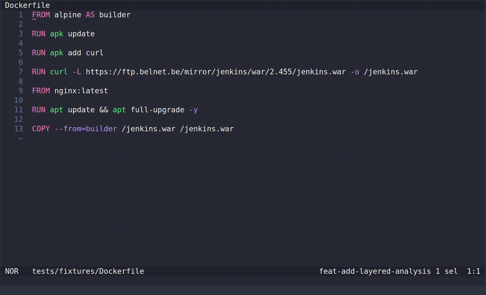

# Layered Analysis

Sysdig LSP provides Layered Analysis to scan each layer created by your Dockerfile instructions individually.
This helps you quickly identify and remediate vulnerabilities introduced at specific steps, optimizing your container security.

> [!IMPORTANT]
> In multi-stage Dockerfiles, layers of the final runtime stage are analyzed individually.
> Intermediate stages are only considered if their layers or artifacts are explicitly copied into the final runtime stage.



## Examples

### Single-stage Dockerfile (fully analyzed)

```dockerfile
FROM ubuntu:22.04
RUN apt-get update && apt-get install -y python3
COPY ./app /app
RUN pip install -r /app/requirements.txt
```
In this Dockerfile, Sysdig LSP individually scans each layer, identifying exactly which step introduces vulnerabilities.

### Multi-stage Dockerfile (layer-focused analysis)

```dockerfile
# Intermediate build stage (layers scanned only if copied)
FROM node:18-alpine AS build
RUN npm install && npm run build

# Final runtime stage (all layers analyzed individually)
FROM nginx:alpine
COPY --from=build /dist /usr/share/nginx/html
RUN apk add --no-cache curl
```
Here, Sysdig LSP individually scans every layer of the final runtime stage (`nginx:alpine`). Layers from the intermediate stage (`node:18-alpine`) are scanned only if their artifacts are explicitly copied to the final stage.
